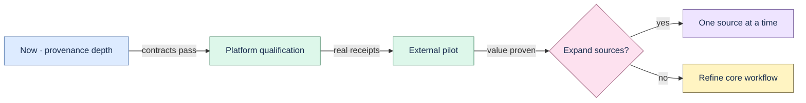

# Proofline roadmap

Baseline: **v1.0.0 experimental** with the completed Decision Evidence Package vertical slice. The
provenance-depth phase closed on 2026-07-16. This file now records only
future work; unchecked items must never be described as implemented.

The product direction is narrow: make engineering decision memory independently inspectable and
hard to corrupt. New artifact types are lower priority than provenance depth.

## Closed phase — Verifiable decision memory

- [x] Hash source-version, chunk, citation, transformation, artifact, review, and root nodes.
- [x] Export deterministic JSON/ZIP evidence packages and verify them offline.
- [x] Explain one artifact and compare two packages without printing source content.
- [x] Protect span, workspace, round-trip, immutability, migration, crash, fuzz, and scale contracts.

The completed scope and verification record are frozen in the
[phase closeout](docs/phase-closeout-2026-07.md).

## Future P0 — Trust and qualification

- [ ] Define an authenticity and signature threat model before adding signing.
- [ ] Define key ownership, rotation, revocation, timestamping, and trust policy.
- [ ] Run scale benchmarks against representative corpora and publish qualified limits.
- [ ] Add a PDF source contract before implementing or fuzzing PDF extraction metadata.

## P1 — Qualify distribution

- [ ] Run install, launch, shutdown, uninstall, upgrade, and rollback on real macOS and Windows hosts.
- [ ] Assign signing ownership; notarize macOS and Authenticode-sign Windows artifacts.
- [ ] Verify updater rollback before enabling automatic updates.
- [ ] Publish checksums and target-specific receipts from the exact released artifacts.

## P2 — Prove external value

- [ ] Recruit five permissioned engineering teams or design partners.
- [ ] Freeze at least 25 real questions, including 10 temporal-decision questions.
- [ ] Obtain citation precision ≥90%, useful-answer rate ≥65%, and median time improvement ≥50%.
- [ ] Observe weekly use by at least three teams and two concrete willingness-to-pay signals.
- [ ] Keep raw sources, identities, prompts, answers, and citations outside the public repository.

Mock and synthetic results validate wiring and invariants only. They cannot satisfy model-quality,
adoption, or pilot gates.

## P3 — Expand only after evidence

- [ ] Add text-layer PDF or transcript ingestion one source contract at a time.
- [ ] Evaluate one high-value connector with stable identity, immutable revision, exact locator,
  permission boundary, idempotent updates, visible failures, deletion cascade, and offline fixtures.
- [ ] Consider shared workspaces only after authentication, RBAC, organization audit, and
  permission-aware retrieval are qualified.

Do not introduce a graph database, rich editor, canvas, connector matrix, generic agents, social
features, or autonomous source write-back as a shortcut.

## Definition of done

A behavior is complete only when its acceptance criteria and failure modes are tested, provenance
survives every transformation, schema changes include migrations, local development remains
offline-capable, user-visible configuration is documented, and relevant test, lint, build, and
evaluation commands pass.
