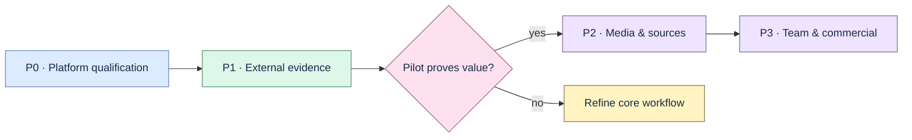

# Proofline roadmap

Current baseline: **v0.14.17 experimental pre-alpha**. The evidence-first vertical slice is
implemented and released. Planned behavior below must not be presented as shipped.

## P0 — Qualify the existing product

- [ ] Run the installed artifact and MSI/NSIS workflow on a real Windows x64 machine.
- [ ] Test native install, launch, shutdown, uninstall, upgrade, and rollback on macOS and Windows.
- [ ] Assign signing ownership; notarize macOS and Authenticode-sign Windows installers.
- [ ] Define and verify native updater rollback before enabling automatic updates.
- [ ] Update release receipts and support matrix from the exact qualified artifacts.

## P1 — External product evidence

- [ ] Recruit five permissioned engineering teams or design partners.
- [ ] Collect at least 25 real questions, including 10 temporal-decision questions.
- [ ] Freeze relevance judgments, source permissions, baseline time, and model configuration.
- [ ] Run the private-pilot analyzer and obtain owner sign-off on aggregate results.
- [ ] Demonstrate citation precision ≥90%, useful-answer rate ≥65%, median time improvement ≥50%,
  weekly use by at least three teams, and two concrete willingness-to-pay signals.
- [ ] Keep raw pilot sources, identities, prompts, answers, and citations outside the public repo.

Real-model comparison remains excluded from the current execution scope. Mock results must stay
labelled `mock_integration` and cannot satisfy model-quality or pilot gates.

## P2 — Media and source coverage

Start only after the initial pilot demonstrates value for the core workflow.

- [ ] Render production MP3/MP4 Studio media with immutable citation manifests.
- [ ] Add model-enhanced Studio generation behind provider interfaces and fail-closed validation.
- [ ] Improve ADR/Markdown import UX and add text-layer PDF ingestion.
- [ ] Add meeting transcripts with timestamp evidence.
- [ ] Evaluate GitHub/GitLab, Jira/Linear, Slack/Teams, Confluence/SharePoint, and CI/CD metadata
  connectors one at a time.

Every connector requires stable identity, immutable revision, exact locator, permission boundary,
idempotent update, visible failures, deletion cascade, and offline fixtures.

## P3 — Team and commercial product

- [ ] Authentication, RBAC, organization audit, and permission-aware retrieval.
- [ ] Team/shared workspaces only after those controls exist.
- [ ] Multi-device sync and managed backup with conflict and recovery contracts.
- [ ] Managed inference, usage accounting, billing, subscription, SSO, retention, and residency.
- [ ] Mobile capture and proactive stale-decision notifications.

Team Brain is blocked until authentication, RBAC, organization audit, and permission-aware
retrieval are qualified. Do not introduce a generic agent builder, graph database, rich editor,
canvas, social feed, plugin marketplace, or autonomous source write-back as a shortcut.

## Open product decisions

- [ ] Select the first ICP using pilot evidence: individual senior engineers or teams of 5–50.
- [ ] Select the paid surface: managed sync, managed AI, team collaboration, or enterprise control.
- [ ] Verify the Proofline trademark, domain, and package names.
- [ ] Keep MIT unless legal advice and contributor-rights planning justify a future license change.

## Definition of done

A change is complete only when acceptance criteria are tested, exact provenance survives every
transformation, schema changes include migrations, failures are visible, retries are idempotent,
deletion cascades, local development still works, documentation is current, and the relevant test,
lint, build, and evaluation commands pass.
