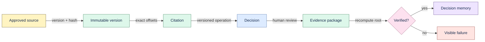

# Proofline

Proofline is a local-first Engineering Decision Memory. It preserves the evidence behind a
decision—not just the decision text—so a later reader can verify which immutable source version,
exact span, and transformation produced each claim.

Current release: **v1.0.0 experimental**. The provenance-depth implementation phase
closed on 2026-07-16; see the [phase closeout](docs/phase-closeout-2026-07.md). Use approved,
recoverable test data only. Proofline is not production-qualified.

## Why Proofline

Engineering teams rarely lose the final answer. They lose the context: which document was current,
which lines supported the choice, what changed, and whether an old conclusion still refers to the
same evidence. Proofline keeps that chain inspectable.



## Current vertical slice

- Immutable ingestion for Markdown, text, notes, registered folders, and tracked local Git files.
- Exact citation offsets and line ranges with workspace isolation and fail-closed validation.
- Deterministic lexical retrieval, optional hybrid retrieval, grounded answers, and abstention.
- Human-reviewed decisions, assumptions, constraints, alternatives, notes, and action proposals.
- Deterministic JSON/ZIP Decision Evidence Packages backed by a content-hashed Merkle DAG.
- Offline package verification, artifact explanation, and content-free package comparison.
- Verified backup/restore, portable transfer, deletion cascade, and integrity checks.
- Optional model providers behind interfaces; the deterministic core works without external AI.

Artifact variety is not the current product priority. The active technical direction is deeper
provenance: stronger lineage, verification, recovery, migration, fuzz, and scale guarantees.

## Quick start

Requirements: Python 3.11+, Node.js 20+, and npm.

```bash
git clone https://github.com/thangldw/proofline.git
cd proofline
make setup
.venv/bin/proofline launch
```

The launcher binds to loopback, chooses an available port, stores state in the platform application
data directory, and opens the bundled UI. For live frontend development, run `make dev-api` and
`make dev-web` in separate terminals.

## Verify a decision

```bash
.venv/bin/proofline export-package ARTIFACT_ID --output evidence.zip
.venv/bin/proofline verify-package evidence.zip
.venv/bin/proofline explain ARTIFACT_ID
.venv/bin/proofline diff before.zip after.zip
```

The package contains hashed source-version, chunk, citation, transformation, artifact, review, and
root nodes. Verification proves package integrity and internal lineage. It does not prove who
created the package; signatures and trust management are not implemented.

See [Decision Evidence Packages](docs/evidence-packages.md) for the hash contract and explicit
failure modes.

## Development quality gate

```bash
make test
make check
make verify-provenance
```

Tests cover exact-span invariants, cross-workspace rejection, deterministic export/import,
source-version immutability, archive fuzzing, migration upgrades, crash recovery, and synthetic
1K/10K/100K provenance benchmarks. Synthetic receipts are regression evidence, not production
performance claims.

## Boundaries

The supported experiment is one local user on a developer-controlled macOS or Linux machine using
recoverable test data. Windows qualification, signed installers, automatic updates, shared
workspaces, hosted sync, production security, external pilot evidence, and real-model quality
claims remain open.

Do not add collaboration, a graph database, rich editing, a generic agent builder, or a connector
matrix unless the roadmap explicitly opens that milestone.

## Documentation

- [Documentation index](docs/README.md)
- [Architecture](docs/architecture.md)
- [Decision Evidence Packages](docs/evidence-packages.md)
- [Roadmap](NEXT_STEPS.md)
- [Support boundary](docs/alpha-support-boundary.md)
- [Production readiness](docs/production-readiness.md)

Proofline is released under the [MIT License](LICENSE). Issues are welcome; there is no SLA or
production warranty. Read [support](SUPPORT.md), [security reporting](SECURITY.md), and
[contributing](CONTRIBUTING.md) before sharing diagnostics or proposing changes.
