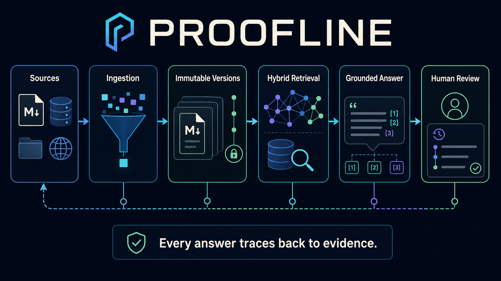
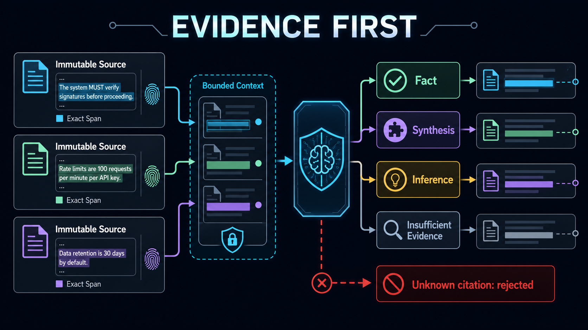
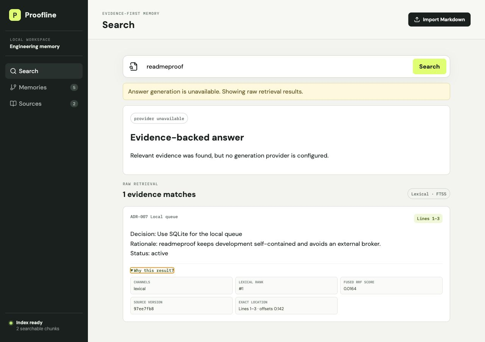
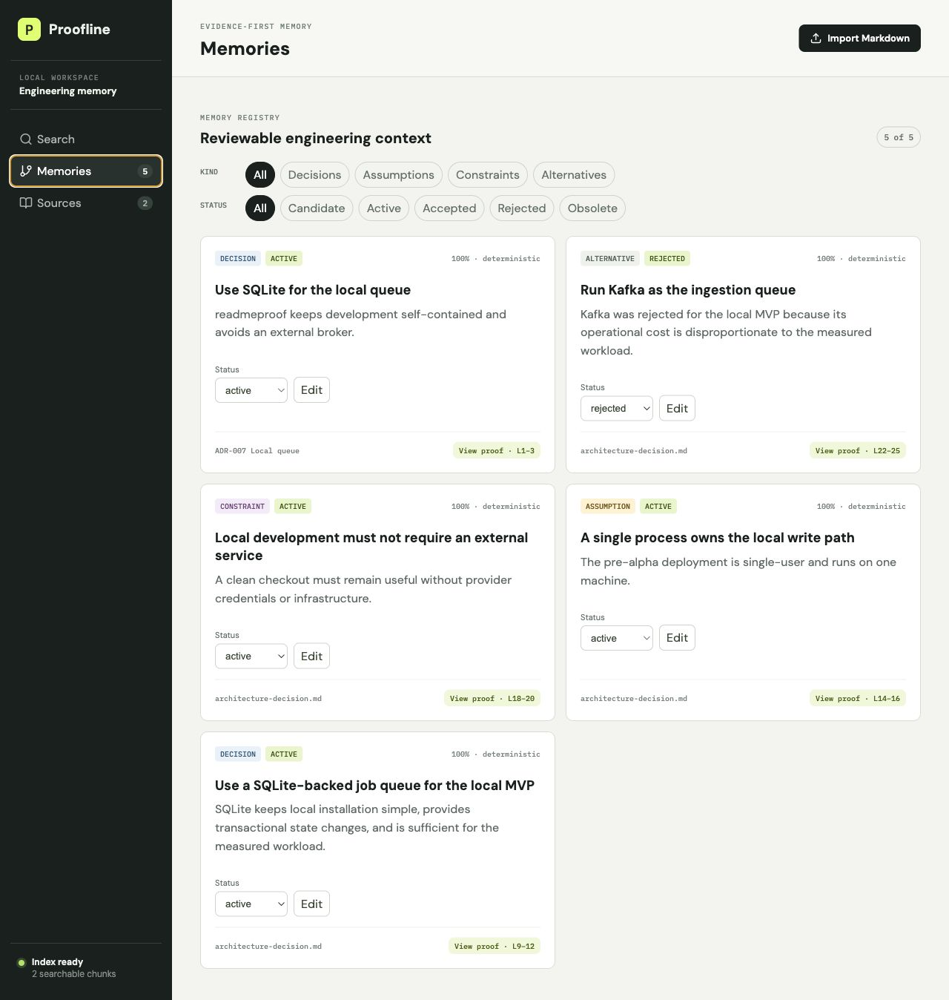
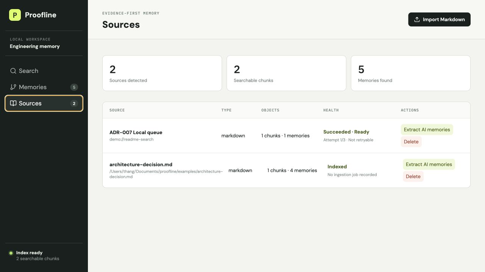

# Proofline

**Evidence-backed engineering memory.**

Proofline is an open-source system that helps engineering teams recover why
software was built the way it was. The current local slice ingests Markdown,
UTF-8 text, and tracked text files plus commit metadata from explicitly registered local Git
repositories; hosted issue, pull-request, and meeting connectors remain planned. The implemented memory registry models decisions,
assumptions, constraints, and alternatives explicitly instead of treating a
knowledge base as an unstructured collection of vector chunks.

> Project status: pre-alpha. The first runnable vertical slice is implemented,
> but it is not ready for production data.



## How Proofline works

Proofline treats provenance as part of the data model, not a decoration added
after generation. Sources are versioned immutably, retrieval returns exact
spans, and generated output can only cite evidence IDs issued by the server.



## Product principles

- **Evidence first:** derived information must remain traceable to an exact
  source span.
- **Local first:** a useful single-user deployment must run on one machine.
- **Inspectable memory:** users can see, correct, reject, and delete derived
  knowledge.
- **Model agnostic:** AI providers are replaceable; source data is not tied to
  a model vendor.
- **Engineering native:** ingest existing engineering artifacts instead of
  requiring a new editor.
- **Reliable before magical:** indexing state, failures, and retrieval choices
  must be observable.

## First vertical slice

The deterministic core runs without an LLM or external service:

1. ingest a Markdown source;
2. preserve its content hash and source locations;
3. preserve immutable versions when the same source URI changes;
4. split it into deterministic, addressable evidence chunks;
5. extract explicitly marked English/Vietnamese decisions, assumptions,
   constraints, and alternatives without an AI model;
6. index the current version locally with SQLite FTS5;
7. search, browse governed memories, and inspect exact historical evidence in the web UI.

This establishes the evidence contract used by the optional model gateway,
hybrid retrieval, governed candidate extraction, and grounded answers.

Every ingestion request also creates an inspectable job record. Source writes and terminal job
success commit atomically. Interrupted jobs recover as retryable failures on startup; deterministic
failures retry at most three times before entering `dead_letter`. Retry payloads are staged in a
private table with integrity hashes and never appear in job diagnostics. Successful, permanent, and
exhausted jobs purge the staged payload.

The API can also scan explicitly registered local roots for Markdown and UTF-8 text. Folder access
is disabled by default, path traversal and symlink escapes are rejected, and missing files are
reported for review. A caller may delete them only in a second scan by confirming the exact
previewed ID set; deletion fails closed if the set drifted or any scan/ingestion result failed. A
uniquely matched same-content file rename keeps the original source identity, immutable version
history, chunks, and evidence; ambiguous matches are never guessed.

Memories can be accepted, rejected, corrected, or marked obsolete. Every change records a
before/after audit event while retaining the original source evidence; complete source deletion
also removes content-bearing audit records. `GET /api/v1/sources/{id}/deletion-impact` reports the
versions, chunks, embeddings, memories, decisions, evidence, jobs, audit events, and FTS rows affected before
a caller confirms deletion. The Sources UI loads this preview and requires explicit confirmation.

Configured generation providers can extract additional governed memory candidates from a source. Model
output is schema-validated, must cite server-issued chunk IDs, remains `candidate` until human
review, records its model run, and is idempotent within an immutable source version.
Schema, size, or evidence-ID validation failures receive at most one bounded repair call using the
same provider, model, evidence pack, and input hashes. Each attempt has a persisted lineage record;
invalid output and validation details are never stored or echoed into the repair prompt. Provider
transport failures are recorded and returned without an automatic repair or provider fallback.
Safe run metadata can be inspected through `/api/v1/model/runs` and
`/api/v1/model/runs/{id}`; filters expose a repair run's parent/child lineage without exposing
source text, prompts, model output, or credentials.
The Model runs web view lists and filters the same safe metadata and lets operators inspect
parent/current/child repair lineage; it never renders input hashes or private model payloads.

The answer endpoint builds a bounded hybrid evidence pack and lets the model reference only
server-issued evidence IDs. Proofline resolves citations itself and verifies every quoted span
against the immutable source version; unknown, missing, or corrupted evidence fails closed.
Newly ingested paragraphs are split into exact spans of at most 1,600 code points. The answer path
also enforces a 64 KiB serialized UTF-8 evidence-pack ceiling and an 8 KiB item ceiling, so legacy
oversized chunks cannot cause unbounded provider egress. Excluded evidence is reported by ID and
reason; if no evidence fits, Proofline returns `insufficient_evidence` without calling a model.

## Product screens

### Evidence-backed search

Search returns inspectable source spans even when no generation provider is
configured. When a provider is available, it receives only the bounded evidence
pack and can cite only server-issued evidence IDs. Retrieval applies deterministic
RRF ordering and a soft per-source diversity cap; “Why this result?” exposes channel,
rank, score, source-version, line, and offset metadata. Search and answer requests can be scoped
to selected source IDs and an indexed-time interval; that interval describes ingestion time, not
the time represented inside a source.

Semantic retrieval uses a default cosine safety floor of `0.0`: invalid, zero-norm,
non-finite, and negative-similarity vectors cannot suppress `insufficient_evidence`.
Search and Answer accept `min_semantic_score` in the range `0..1`, but this is an
embedding-model-specific control—not a calibrated relevance guarantee.



### Governed memory registry

Deterministically extracted and AI-proposed decisions, assumptions, constraints,
and alternatives share one filterable review surface. Each memory exposes its
kind, confidence, extraction method, lifecycle controls, and exact supporting lines.



### Source inventory

The source inventory makes indexing observable: detected sources, searchable
chunks, extracted memories, source type, latest job stage/attempt, safe failures,
and per-source actions remain visible.



### Safe model-run diagnostics

The Model runs view filters by status, operation, provider, and parent run. Its detail panel exposes
validation, timing, token counts, safe error codes, and repair lineage without displaying source
text, prompts, model output, credentials, or input hashes.

## Repository layout

```text
proofline/
├── apps/api/           # FastAPI, SQLite persistence, ingestion, retrieval
├── apps/web/           # React/Vite evidence console
├── docs/               # Product, architecture, ADRs, and roadmap
├── deploy/             # Local container deployment
└── .github/workflows/  # Automated quality gates
```

## Development

Prerequisites: Python 3.11+, Node.js 20 LTS or 22+, and npm. Then run:

```bash
make setup
make seed
make dev-api
# In a second terminal:
make dev-web
```

Open http://localhost:5173. The local API docs are at
http://localhost:8000/docs. Common quality commands are:

```bash
make test
make check
make eval
npm run test:e2e
```

The pre-alpha workflow runs source-development smoke checks
on Ubuntu and macOS 14 with Python 3.11 and Node.js 20. Its checked-in script covers
installation, local SQLite ingestion/search, exact evidence, portable export/import,
raw backup verification, and an optimized web build without model
credentials or external runtime services. A successful hosted receipt for revision `0dde53f` is
recorded under [`evals/platform/`](evals/platform/github-actions-0dde53f.json). It does not claim
native desktop packaging, production deployment support, or verified Windows support.

The configured Ubuntu browser job runs the credential-free import, memory review/correction,
retrieval diagnostics, exact-evidence navigation, and deletion workflow in Chromium. Its hostile
Markdown fixture verifies script/image payloads remain inert and records any non-loopback request
as a failure. The recorded hosted run passed this job; it is not a production security
qualification.

The current credential-free retrieval gate is `evals/retrieval/seed-v2.json`: 26 synthetic queries
cover Unicode lexical retrieval plus initial/current revisions and expected-empty superseded terms.
The deterministic extraction gate covers all four memory kinds and exact evidence/hash resolution.
Both are regression contracts only; they do not establish real-model or pilot quality.

Remaining beta/production qualification gates include real-model and external-pilot evidence, a
repository security-plugin scan, reranking, scalable vector indexing, Windows verification, and
production qualification. They do not block an explicitly experimental pre-alpha tag.

## Releases

Provider profiles, secret-handling rules, health checks, and retry semantics are documented in
the [provider configuration guide](docs/provider-configuration.md).

`v0.5.0` is the latest experimental pre-alpha release. It adds local provider settings, separate
capability health, bounded transient retries, and explicit model-run retry/dead-letter handling.
Assets include the local API/CLI wheel and source distribution plus an optimized, unhosted web
archive for integrators. The web archive is not a standalone server: deploy it behind a same-origin
reverse proxy that forwards `/api` and `/health` to the loopback-bound Proofline API, or use the
proven two-process development workflow above. See the
[release notes](docs/releases/v0.5.0.md) and verify `SHA256SUMS` before installation.

### Data portability and recovery

Proofline can write an inspectable portable JSON snapshot or a complete local
SQLite backup. Always verify the artifact after creating it:

```bash
.venv/bin/proofline export --output proofline-export.json
.venv/bin/proofline verify-export proofline-export.json
.venv/bin/proofline import proofline-export.json

.venv/bin/proofline backup --output proofline-backup.db
.venv/bin/proofline verify-backup proofline-backup.db
.venv/bin/proofline verify-integrity
```

Portable import accepts schema v1 only and restores into a completely empty initialized database.
It preserves exported IDs, immutable source versions, governed memories, evidence, safe model-run
lineage, audit events, and terminal ingestion diagnostics in one transaction. It rebuilds
deterministic chunks and FTS rows, but not embeddings, and records a payload-hash receipt. It does
not merge, overwrite, remap IDs, or restore excluded private retry inputs. The SQLite backup remains
the exact local recovery artifact and contains all local data, including sensitive source contents
and private staged retry inputs. See the
[backup and recovery guide](docs/backup-recovery.md) before storing or restoring
either artifact.

`verify-integrity` performs a read-only semantic check of the configured live SQLite database. It
validates source identities and immutable versions, exact chunk and evidence spans, evidence
hashes, embedding ownership, and FTS rows. Success output contains counts only; failures return a
stable code without source text. Run it after a restore and before creating a release artifact.

Imported terminal ingestion diagnostics retain their historical `retryable` flag for payload
fidelity, but their private staged input is intentionally absent. Retrying such a diagnostic fails
closed to `dead_letter` with `ingestion_input_missing`; re-ingest the authorized source instead.

Folder access is disabled unless roots are explicitly registered. Use the operating-system path
separator (`:` on Unix-like systems, `;` on Windows), restart the API, then request a scan:

```bash
export PROOFLINE_IMPORT_ROOTS="/absolute/path/to/engineering-docs"
curl -X POST http://localhost:8000/api/v1/folder-scans \
  -H 'Content-Type: application/json' \
  -d '{}'
```

Only `.md`, `.markdown`, and `.txt` files are read. The first scan only previews missing IDs.
Confirmed deletion requires `delete_missing=true` plus the exact `confirmed_missing_source_ids`
from that preview and fails closed on drift or scan errors.

An opt-in, single-process polling watcher can run the same deterministic scan immediately at API
startup and then at a fixed interval. It is disabled by default; enable it with an integer from 1
to 3600 seconds and inspect its content-free ephemeral status:

```bash
export PROOFLINE_FOLDER_WATCH_INTERVAL_SECONDS=30
curl http://localhost:8000/api/v1/folder-watch
```

Watcher cycles and manual folder scans share one process-local coordinator, execute sequentially,
and never overlap. Watcher roots use a fresh database session and always keep missing-file handling
in preview-only mode; deletion still requires the separate confirmed request above. Run at most one
enabled API worker against a vault. Clean shutdown waits for any active scan to finish, so a slow or
unavailable filesystem can delay process termination.

Docker Compose does not mount any host vault by default. To watch through Compose, add an explicit
read-only bind mount in a local override (for example, `./docs:/vault:ro`) and register the matching
container path (`PROOFLINE_IMPORT_ROOTS=/vault`). Do not register a host-only path that the container
cannot access.

Upload clients may send an `Idempotency-Key` header. Replaying the same key and payload returns the
original successful job; reusing a key with different content is rejected. Failed retryable jobs
can be resumed with `POST /api/v1/jobs/{job_id}/retry`.

AI is disabled by default. A local OpenAI-compatible endpoint can be configured with
`PROOFLINE_AI_PROVIDER=openai_compatible`, `PROOFLINE_AI_BASE_URL`, and
`PROOFLINE_AI_MODEL`. Sending content to a non-loopback endpoint additionally requires the
explicit `PROOFLINE_ALLOW_REMOTE_AI=true` setting. API keys are read from
`PROOFLINE_AI_API_KEY` and are never persisted in model-run records.

Embeddings use a separate model configuration: `PROOFLINE_EMBEDDING_PROVIDER`,
`PROOFLINE_EMBEDDING_BASE_URL`, `PROOFLINE_EMBEDDING_MODEL`, and optionally
`PROOFLINE_EMBEDDING_API_KEY`. After configuration, build the incremental index with
`make embed` or `POST /api/v1/model/embeddings/index`. Search and grounded answers then fuse FTS5 and dense ranks
with reciprocal-rank fusion; without an embedding provider or index they remain lexical-only.

Run the local container stack with:

```bash
docker compose -f deploy/docker-compose.yml up --build
```

Docker Compose publishes the unauthenticated pre-alpha API on `127.0.0.1` by
default. `PROOFLINE_API_BIND` can override the host interface, but exposing it
beyond loopback requires operator-supplied authentication and network controls;
CORS is not an access-control boundary.

## Scope

Proofline is not building a rich-text editor, canvas, generic agent builder,
custom model runtime, or graph database in the MVP. See
[`docs/`](docs/) for the product brief, architecture, decisions, and roadmap.

## License

This repository is currently licensed under the [MIT License](LICENSE).
Licensing boundaries for a future open-core distribution must be decided and
documented before accepting substantial external contributions.
