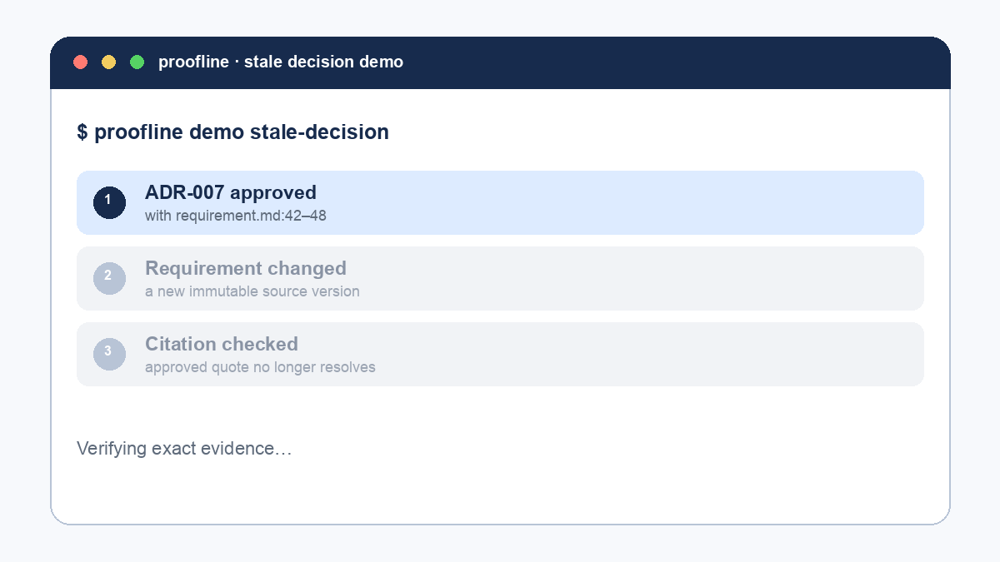
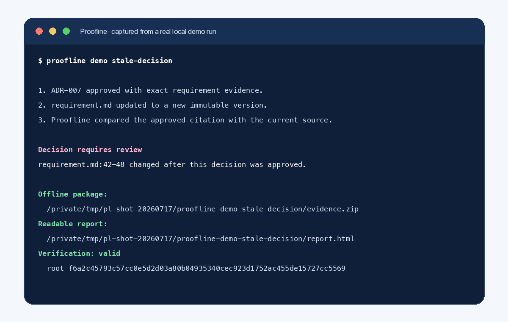
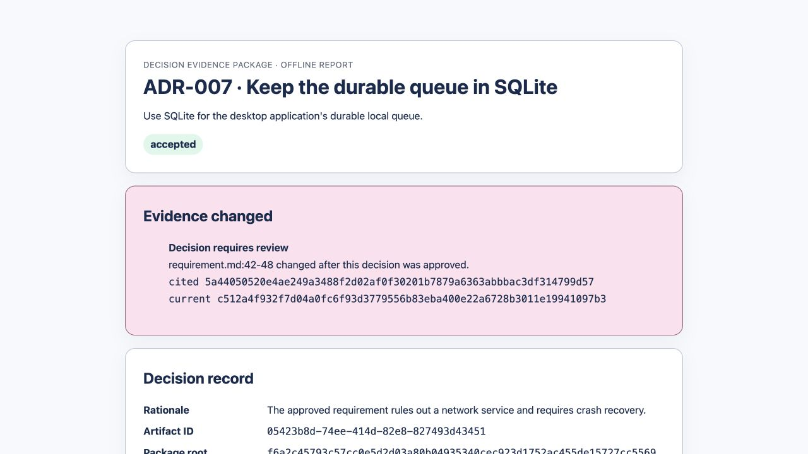

# Proofline

> Proofline shows what evidence justified an engineering decision and warns you when that evidence changes.



Proofline is a local-first Engineering Decision Memory for **ADRs with evidence**. It keeps the
decision, the immutable source version that justified it, and the exact cited lines together—then
flags the ADR when that evidence changes.

## See the product story

```bash
proofline demo stale-decision
```

The credential-free demo creates an approved architecture decision citing `requirement.md:42-48`,
revises that requirement, checks the citation against the current immutable version, and prints:

```text
Decision requires review
requirement.md:42-48 changed after this decision was approved.
```

It writes three inspectable artifacts to `proofline-demo-stale-decision/`:

- `evidence.zip` — the self-contained Decision Evidence Package;
- `report.html` — a readable, offline HTML view of the decision and exact evidence;
- `decision-health.json` — a content-free receipt linking the stale finding to both source hashes
  and the package root.

Verify the package without a database, credentials, model provider, or network:

```bash
proofline verify-package proofline-demo-stale-decision/evidence.zip
```

Then open `proofline-demo-stale-decision/report.html` in any local browser.

## Real demo output

These screenshots come from one credential-free local run of the command above. IDs and hashes are
run-specific; the review finding and independently verifiable package are the stable behavior.





## Use case: an ADR with evidence

An ADR says “keep the durable desktop queue in SQLite.” Proofline records not only that choice, but
the requirement revision and lines that ruled out a network service and required crash recovery.
When those lines change, reviewers get a precise reason to revisit the ADR instead of a generic
“document updated” notification.

The check is deterministic: a source can change elsewhere without invalidating the ADR, but the
approved exact quote must still resolve in the current source version.

## Why Proofline instead of ADR-only, a wiki, or generic RAG?

- **ADR-only:** an ADR records the choice; Proofline also preserves the exact source version and
  lines that justified it, then flags the decision when that evidence changes.
- **Wiki or Notion:** a wiki is better for flexible team documentation; Proofline is narrower and
  keeps approved evidence immutable and independently verifiable instead of relying on mutable
  pages and links.
- **Generic RAG:** RAG retrieves likely relevant context at question time; Proofline uses
  deterministic source identities and exact spans for claims that must remain auditable.

Proofline can complement all three. It is for decisions where recovering the original evidence—and
knowing when it stopped matching—matters more than broad knowledge capture.

## Quick start

Requirements: Python 3.11+, Node.js 20+, and npm.

```bash
git clone https://github.com/thangldw/proofline.git
cd proofline
make setup
.venv/bin/proofline demo stale-decision
```

Launch the experimental local UI with `.venv/bin/proofline launch`. For live frontend development,
run `make dev-api` and `make dev-web` in separate terminals.

## CI: fail stale decisions without writing

```bash
PROOFLINE_HOME=/path/to/existing/proofline-state proofline check-decisions
```

`check-decisions` only reads the initialized database. It exits `0` when every approved exact
citation resolves in its source's current version, `1` when review is required, and fails closed for
missing or corrupt provenance. Use `--format json` for machine-readable output. It never ingests,
migrates, repairs, or updates review state; local SQLite is opened with `mode=ro`.

## Open Decision Evidence Package

DEP v1 is published as an open format with a [JSON Schema, test vectors, and versioning
policy](spec/decision-evidence-package/README.md). Proofline exports canonical JSON or deterministic
ZIP and a self-contained HTML projection:

```bash
proofline export-package ARTIFACT_ID --output evidence.zip --html-report report.html
proofline verify-package evidence.zip
proofline explain ARTIFACT_ID
proofline diff before.zip after.zip
```

Package verification proves internal integrity and exact lineage. It does not prove who created a
package or whether the original source was trustworthy; signatures and trust management are not
implemented.

## Development and measured boundaries

```bash
make test
make check
make verify-provenance
make benchmark-evidence-package
```

The committed [reproducible benchmark receipt](docs/benchmarks.md) reports ingest time, package
build and verify latency, JSON/ZIP size, and peak Python memory for a synthetic local ADR fixture.
It is regression evidence, not a production capacity claim.

Proofline is experimental pre-alpha for one local user with recoverable test data. Production
qualification, authenticity/signing, shared workspaces, hosted sync, and permission-aware
connectors remain outside the implemented boundary. The deeper technical model lives in
[architecture](docs/architecture.md), [provenance model](docs/provenance-model.md), [evidence package
contract](docs/evidence-packages.md), and [production readiness](docs/production-readiness.md).

See the [documentation index](docs/README.md), [roadmap](NEXT_STEPS.md), [support](SUPPORT.md), and
[security reporting](SECURITY.md). Proofline is released under the [MIT License](LICENSE).
