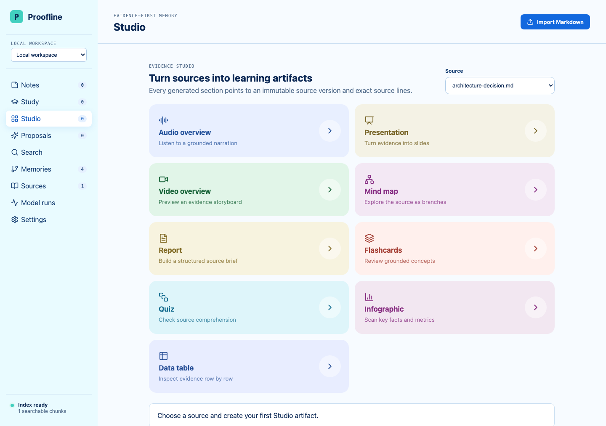
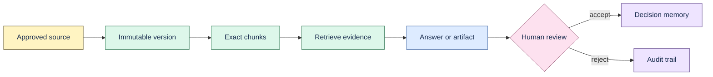

# Proofline

Proofline is a local-first Engineering Decision Memory. It turns Markdown, text, notes, registered
folders, and local Git repositories into searchable evidence while preserving an immutable source
identity and exact source span for every derived claim.

Current release: **v0.14.17 experimental pre-alpha**. Use approved, recoverable test data only.
Windows qualification, signed installers, external pilot evidence, and production support remain
open.

## Product demo



Evidence Studio running locally with the bundled example source. The screenshot shows the current
web bundle and does not depend on an external model or font service.

## Product flow



## What works

- Deterministic ingestion with immutable source versions, exact offsets, and line numbers.
- Local Git repository ingestion pinned to commit SHA and tracked file path.
- FTS5 retrieval, optional embeddings/reranking, grounded answers, and explicit abstention.
- Reviewable decisions, assumptions, constraints, alternatives, and temporal decision relations.
- Notes with revisions, hashtags, wiki-links, backlinks, study cards, and review history.
- Evidence Studio artifacts with exact citations and downloadable evidence packages.
- Workspace isolation, deletion preview/cascade, audit history, backup/restore, and portable export.
- Provider settings for local and OpenAI-compatible services with optional OS keyring storage.
- Bundled web UI, one-command local launcher, and an experimental Tauri macOS application.

## Quick start

Requirements: Python 3.11+, Node.js 20+, and npm.

```bash
git clone https://github.com/thangldw/proofline.git
cd proofline
make setup
.venv/bin/proofline launch
```

The launcher binds to loopback, chooses an available port, stores state in the platform application
data directory, and opens the bundled UI. For development with live frontend reload:

```bash
make dev-api
make dev-web
```

Run the quality gate before submitting a change:

```bash
make test
make check
```

## Evidence contract

Every accepted derived object must retain:

```text
workspace → source → immutable version → exact offsets/lines → derived object
```

Unknown, deleted, cross-workspace, or hash-mismatched evidence fails closed. Re-ingestion is
idempotent, extraction failures remain visible, and source deletion includes derived indexes,
memories, study material, proposals, and Studio citations.

## Model providers

Proofline works offline for deterministic ingestion, retrieval, and review. AI features are
optional. Configure providers in **Settings** or with environment variables. Secrets are never
returned by the API; desktop launch defaults to the operating-system keyring.

See [provider configuration](docs/provider-configuration.md) for supported fields and failure
behavior. Synthetic and mock evaluations are regression evidence only, not model-quality claims.

## Data operations

```bash
.venv/bin/proofline verify-integrity
.venv/bin/proofline backup --help
.venv/bin/proofline restore-backup --help
.venv/bin/proofline export --help
.venv/bin/proofline import --help
```

Read [backup and recovery](docs/backup-recovery.md) before upgrades or restore drills.

## Desktop builds

The GitHub release contains an unsigned experimental macOS ARM64 DMG. A Windows build workflow is
available but must run on real Windows hardware before Windows support can be claimed. Native
signing, notarization, update rollback, and uninstall qualification are not complete.

## Documentation

- [Documentation index](docs/README.md)
- [Architecture](docs/architecture.md)
- [Visual language and typography](docs/visual-language.md)
- [Current roadmap](NEXT_STEPS.md)
- [Production readiness](docs/production-readiness.md)
- [Alpha support boundary](docs/alpha-support-boundary.md)
- [Release notes](docs/releases/v0.14.17.md)

## Project status

Proofline is public under the [MIT License](LICENSE). Issues are welcome, but there is no SLA or
production warranty. Read [support](SUPPORT.md), [security reporting](SECURITY.md), and
[contributing](CONTRIBUTING.md) before sharing diagnostics or proposing changes.
