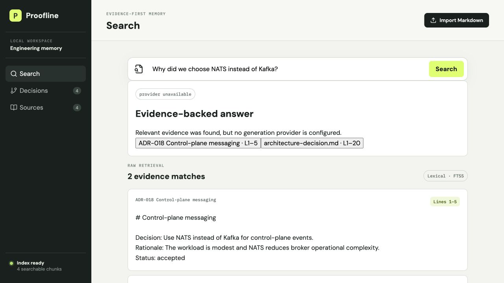
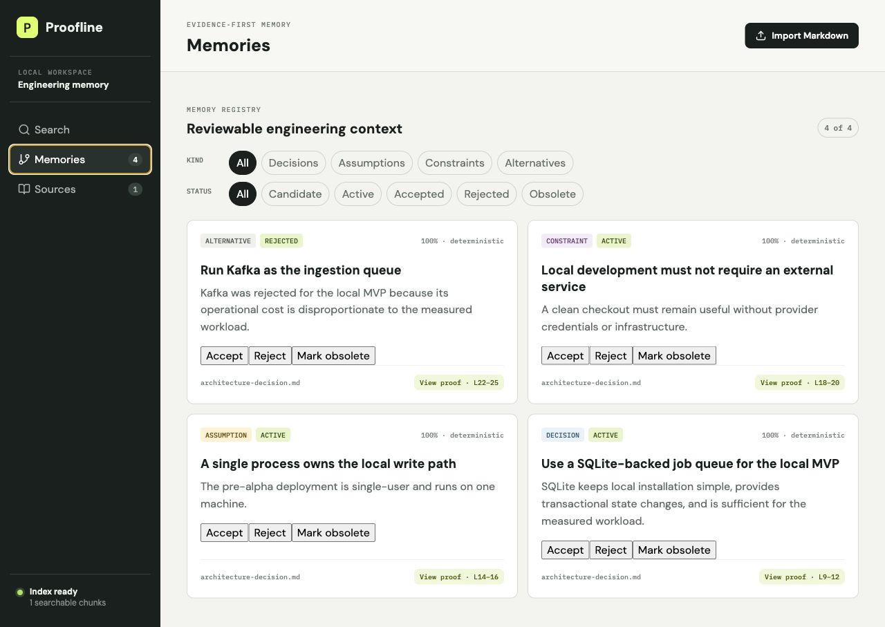
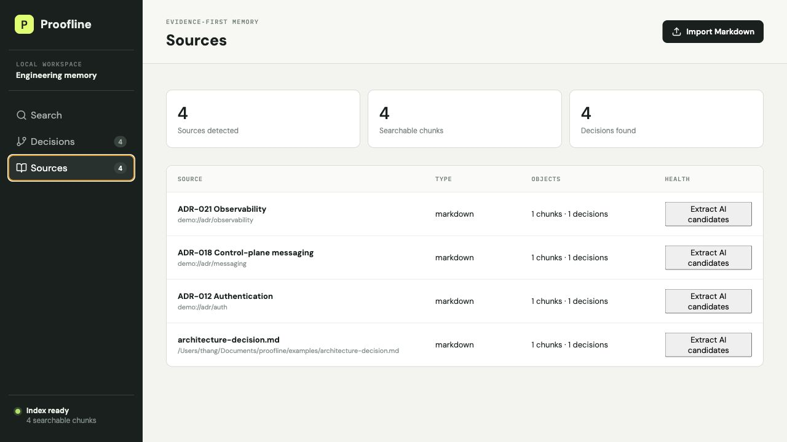

# Proofline

**Evidence-backed engineering memory.**

Proofline is an open-source system that helps engineering teams recover why
software was built the way it was. It connects source material such as ADRs,
design notes, issues, pull requests, commits, and meeting transcripts to
searchable evidence. The implemented memory registry models decisions,
assumptions, constraints, and alternatives explicitly instead of treating a
knowledge base as an unstructured collection of vector chunks.

> Project status: pre-alpha. The first runnable vertical slice is implemented,
> but it is not ready for production data.


## How Proofline works

Proofline treats provenance as part of the data model, not a decoration added
after generation. Sources are versioned immutably, retrieval returns exact
spans, and generated output can only cite evidence IDs issued by the server.


## Product principles

- **Evidence first:** derived information must remain traceable to an exact
  source span.
- **Local first:** a useful single-user deployment must run on one machine.
- **Inspectable memory:** users can see, correct, reject, and delete derived
  knowledge.
- **Model agnostic:** AI providers are replaceable; source data is not tied to
  a model vendor.
- **Engineering native:** ingest existing engineering artifacts instead of
  requiring a new editor.
- **Reliable before magical:** indexing state, failures, and retrieval choices
  must be observable.

## First vertical slice

The deterministic core runs without an LLM or external service:

1. ingest a Markdown source;
2. preserve its content hash and source locations;
3. preserve immutable versions when the same source URI changes;
4. split it into deterministic, addressable evidence chunks;
5. extract explicitly marked English/Vietnamese decisions, assumptions,
   constraints, and alternatives without an AI model;
6. index the current version locally with SQLite FTS5;
7. search, browse decisions, and inspect exact historical evidence in the web UI.

This establishes the evidence contract used by the optional model gateway,
hybrid retrieval, governed candidate extraction, and grounded answers.

Every ingestion request also creates an inspectable job record. Source writes and terminal job
success commit atomically. Interrupted jobs recover as retryable failures on startup; deterministic
failures retry at most three times before entering `dead_letter`. Retry payloads are staged in a
private table with integrity hashes and never appear in job diagnostics. Successful, permanent, and
exhausted jobs purge the staged payload.

The API can also scan explicitly registered local roots for Markdown and UTF-8 text. Folder access
is disabled by default, path traversal and symlink escapes are rejected, and missing files are
reported for review rather than deleted automatically. A uniquely matched same-content file rename
keeps the original source identity, immutable version history, chunks, and evidence; ambiguous
matches are never guessed.

Memories can be accepted, rejected, corrected, or marked obsolete. Every change records a
before/after audit event while retaining the original source evidence; complete source deletion
also removes content-bearing audit records. `GET /api/v1/sources/{id}/deletion-impact` reports the
versions, chunks, embeddings, memories, decisions, evidence, jobs, audit events, and FTS rows affected before
a caller confirms deletion. The Sources UI loads this preview and requires explicit confirmation.

Configured generation providers can extract additional governed memory candidates from a source. Model
output is schema-validated, must cite server-issued chunk IDs, remains `candidate` until human
review, records its model run, and is idempotent within an immutable source version.
Schema, size, or evidence-ID validation failures receive at most one bounded repair call using the
same provider, model, evidence pack, and input hashes. Each attempt has a persisted lineage record;
invalid output and validation details are never stored or echoed into the repair prompt. Provider
transport failures are recorded and returned without an automatic repair or provider fallback.
Safe run metadata can be inspected through `/api/v1/model/runs` and
`/api/v1/model/runs/{id}`; filters expose a repair run's parent/child lineage without exposing
source text, prompts, model output, or credentials.

The answer endpoint builds a bounded lexical evidence pack and lets the model reference only
server-issued evidence IDs. Proofline resolves citations itself and verifies every quoted span
against the immutable source version; unknown, missing, or corrupted evidence fails closed.

## Product screens

### Evidence-backed search

Search returns inspectable source spans even when no generation provider is
configured. When a provider is available, it receives only the bounded evidence
pack and can cite only server-issued evidence IDs.



### Governed memory registry

Deterministically extracted and AI-proposed decisions, assumptions, constraints,
and alternatives share one filterable review surface. Each memory exposes its
kind, confidence, extraction method, lifecycle controls, and exact supporting lines.



### Source inventory

The source inventory makes indexing observable: detected sources, searchable
chunks, extracted memories, source type, latest job stage/attempt, safe failures,
and per-source actions remain visible.



## Repository layout

```text
proofline/
├── apps/api/           # FastAPI, SQLite persistence, ingestion, retrieval
├── apps/web/           # React/Vite evidence console
├── docs/               # Product, architecture, ADRs, and roadmap
├── deploy/             # Local container deployment
└── .github/workflows/  # Automated quality gates
```

## Development

Prerequisites: Python 3.11+, Node.js 20 LTS or 22+, and npm. Then run:

```bash
make setup
make seed
make dev-api
# In a second terminal:
make dev-web
```

Open http://localhost:5173. The local API docs are at
http://localhost:8000/docs. Common quality commands are:

```bash
make test
make check
make eval
```

Folder access is disabled unless roots are explicitly registered. Use the operating-system path
separator (`:` on Unix-like systems, `;` on Windows), restart the API, then request a scan:

```bash
export PROOFLINE_IMPORT_ROOTS="/absolute/path/to/engineering-docs"
curl -X POST http://localhost:8000/api/v1/folder-scans \
  -H 'Content-Type: application/json' \
  -d '{}'
```

Only `.md`, `.markdown`, and `.txt` files are read. Missing files are reported for review and are
not deleted by a scan.

Upload clients may send an `Idempotency-Key` header. Replaying the same key and payload returns the
original successful job; reusing a key with different content is rejected. Failed retryable jobs
can be resumed with `POST /api/v1/jobs/{job_id}/retry`.

AI is disabled by default. A local OpenAI-compatible endpoint can be configured with
`PROOFLINE_AI_PROVIDER=openai_compatible`, `PROOFLINE_AI_BASE_URL`, and
`PROOFLINE_AI_MODEL`. Sending content to a non-loopback endpoint additionally requires the
explicit `PROOFLINE_ALLOW_REMOTE_AI=true` setting. API keys are read from
`PROOFLINE_AI_API_KEY` and are never persisted in model-run records.

Embeddings use a separate model configuration: `PROOFLINE_EMBEDDING_PROVIDER`,
`PROOFLINE_EMBEDDING_BASE_URL`, `PROOFLINE_EMBEDDING_MODEL`, and optionally
`PROOFLINE_EMBEDDING_API_KEY`. After configuration, build the incremental index with
`make embed` or `POST /api/v1/model/embeddings/index`. Search and grounded answers then fuse FTS5 and dense ranks
with reciprocal-rank fusion; without an embedding provider or index they remain lexical-only.

Run the local container stack with:

```bash
docker compose -f deploy/docker-compose.yml up --build
```

## Scope

Proofline is not building a rich-text editor, canvas, generic agent builder,
custom model runtime, or graph database in the MVP. See
[`docs/`](docs/) for the product brief, architecture, decisions, and roadmap.

## License

This repository is currently licensed under the [MIT License](LICENSE).
Licensing boundaries for a future open-core distribution must be decided and
documented before accepting substantial external contributions.
