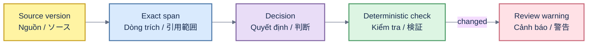

# Proofline

[English](#english) · [Tiếng Việt](#tiếng-việt) · [日本語](#日本語)

Proofline shows which immutable evidence justified an engineering decision, traces explicit downstream impact when that evidence changes, and signs portable evidence attestations.


```mermaid
%%{init: {"theme":"base","themeVariables":{"background":"#FFFFFF","fontFamily":"Arial, sans-serif","lineColor":"#667085","primaryTextColor":"#172B4D"}}}%%
flowchart LR
    S["Source version<br/>Nguồn / ソース"]:::yellow
    P["Exact span<br/>Dòng trích / 引用範囲"]:::blue
    D["Decision<br/>Quyết định / 判断"]:::purple
    C["Deterministic check<br/>Kiểm tra / 検証"]:::green
    R["Review warning<br/>Cảnh báo / 警告"]:::pink
    S --> P --> D --> C
    C -->|changed| R
    classDef yellow fill:#FFF4A3,stroke:#C9A227,stroke-width:2px,color:#172B4D
    classDef blue fill:#D9EAFD,stroke:#4C78A8,stroke-width:2px,color:#172B4D
    classDef purple fill:#E9DDF7,stroke:#8064A2,stroke-width:2px,color:#172B4D
    classDef green fill:#DDF5E3,stroke:#4F9D69,stroke-width:2px,color:#172B4D
    classDef pink fill:#FFE1E6,stroke:#C96A7B,stroke-width:2px,color:#172B4D
```

## English

Proofline is a local-first Engineering Decision Memory for evidence-backed ADRs. It preserves source identity, source version and exact cited spans, exports self-contained Decision Evidence Packages, and performs deterministic stale-decision checks without requiring an AI provider.

Decision status and evidence health are separate: an approved ADR remains historical fact while a stale citation is shown as **Accepted · review required**. Proofline never silently rewrites an accepted decision.

Explicit `based_on` and `implements` relations produce cycle-safe transitive impact paths. Ed25519 attestations bind a verified package and optional review receipt to a trusted public key; signing and verification remain local and AI-provider independent.

Requirements: Python 3.11+, Node.js 20+ and npm.

```bash
python -m pip install proofline-evidence
proofline demo stale-decision
```

For repository development:

```bash
make setup
.venv/bin/proofline demo stale-decision
.venv/bin/proofline verify-package proofline-demo-stale-decision/evidence.zip
.venv/bin/proofline verify-review-receipt proofline-demo-stale-decision/decision-review.json
.venv/bin/proofline check-impacts --format sarif
make test
make check
```

The current boundary is a single-user local workflow with recoverable data. Hosted sync, shared workspaces, organization identity, trusted timestamps, key revocation and permission-aware connector fleets are not implemented.

Current technical references: [architecture](docs/architecture.md), [evidence package formats](docs/evidence-packages.md), [operations](docs/OPERATIONS.md), [security](SECURITY.md) and [v2.0.0 release notes](docs/releases/v2.0.0.md).

The repository is also packaged as a local plugin for ChatGPT, Codex, Claude Code and Cowork. Proofline is listed in the public [OpenAI Plugins Directory](https://chatgpt.com/plugins/plugins_6a6efdf2ccbc81919ebb4cb01805ebaa); the exact submitted/public version is tracked in the [directory submission package](docs/submission/DIRECTORY_SUBMISSION.md). It does not claim hosted sync or a remote MCP connector. See the [privacy policy](PRIVACY.md), [terms](TERMS.md), and [support guidance](SUPPORT.md).

## Tiếng Việt

Proofline là bộ nhớ quyết định kỹ thuật local-first dành cho ADR có bằng chứng. Hệ thống giữ định danh nguồn, phiên bản nguồn và đúng đoạn trích; phát hiện transitive impact qua quan hệ explicit; xuất package độc lập và ký attestation Ed25519 mà không phụ thuộc nhà cung cấp AI.

Yêu cầu: Python 3.11+, Node.js 20+ và npm. Dùng các lệnh ở phần English để cài đặt, chạy demo và kiểm thử. Phạm vi hiện tại là quy trình local cho một người dùng; chưa có đồng bộ hosted, workspace dùng chung, định danh tổ chức, trusted timestamp hoặc hệ connector phân quyền.

## 日本語

Proofline は、根拠付き ADR のためのローカルファーストな Engineering Decision Memory です。正確な引用範囲を保持し、明示的な関係による推移的影響を追跡し、AI プロバイダーなしで Ed25519 attestation を署名・検証します。

必要環境は Python 3.11 以上、Node.js 20 以上、npm です。現在は単一ユーザーのローカル利用が対象で、ホスト同期、共有ワークスペース、組織 identity、信頼時刻、権限対応コネクター群は未実装です。

Released under the [MIT License](LICENSE).
