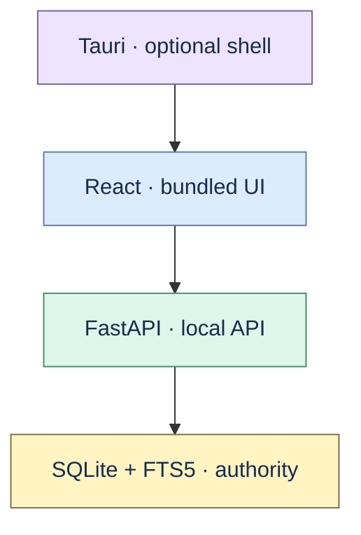

# ADR 0001: Local evidence-first vertical slice

Status: accepted.

Proofline uses Python/FastAPI, SQLite/FTS5, React, and an optional Tauri wrapper for a single-user
local application. This stack keeps deterministic ingestion, migrations, retrieval, backup, and
exact provenance usable without external services.

The first product boundary excludes collaboration, hosted sync, broad connectors, rich editing,
canvas, graph databases, generic agents, and autonomous source write-back. New surfaces must extend
the immutable source/version/span contract rather than bypass it.
