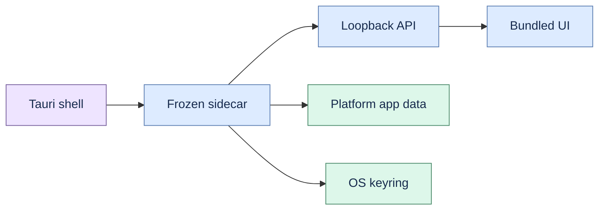

# ADR 0003: Experimental Tauri packaging

Status: revised and implemented experimentally.

Proofline now packages the bundled web UI and a frozen Python sidecar in Tauri v2. The wrapper uses
dynamic loopback readiness, platform application-data paths, OS keyring mode, and private graceful
shutdown.

This decision authorizes experimental builds only. Supported native distribution still requires
real-Windows qualification, macOS notarization, Windows Authenticode, install/uninstall/upgrade
receipts, and updater rollback. The Python wheel launcher remains the primary supported experiment.
