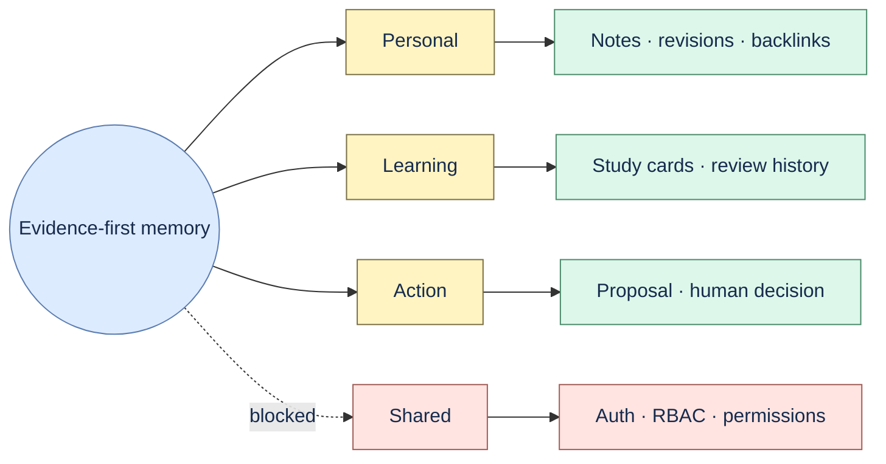

# ADR 0004: Evidence-first personal, learning, and action memory

Status: accepted and implemented for a single local user.

Notes create immutable source revisions; hashtags and wiki-links use deterministic offsets;
backlinks identify the exact originating revision. Study cards derive from explicit source patterns
and keep append-only review history. Action proposals remain grounded candidates with exact
citations and human accept/reject audit.

Team Brain is not an extension of this local decision. It requires authentication, RBAC,
organization audit, and permission-aware retrieval before shared data or collaboration can begin.
