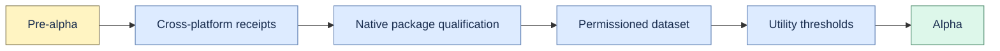

# Alpha support boundary

Proofline v1.0.0 remains an experimental, non-production-qualified release.

## Supported experiment

- One local user on a developer-controlled macOS or Linux machine.
- Python 3.11+ wheel, loopback API, bundled web UI, and local SQLite.
- Approved, recoverable Markdown, text, folder, note, and local Git test sources.
- Deterministic ingestion, exact evidence, retrieval, review, Studio, export, and backup workflows.

## Unsupported

Windows support, signed installers, automatic updates, mobile, shared workspaces, authentication,
RBAC, hosted sync, internet-facing deployment, regulated data, availability commitments, real-model
quality claims, external adoption claims, and autonomous source write-back.

## Criteria for alpha

1. Installed artifacts pass lifecycle and recovery receipts on current macOS, Linux, and Windows.
2. Native signing, install, uninstall, upgrade, and update rollback have owners and receipts.
3. A permissioned dataset includes 25 real questions and 10 temporal questions.
4. Citation precision reaches 90% and useful-answer rate reaches 65% on that dataset.
5. At least three design partners complete install, upgrade, and recovery.
6. Support, migration, rollback, data-loss escalation, and platform versions are release-specific.

Versioned snapshots do not create compatibility, uptime, or data-loss guarantees.
