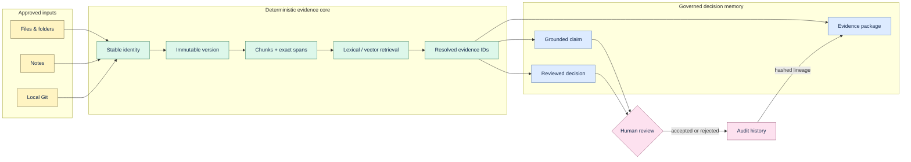

# Architecture

Proofline is a local Python/FastAPI application with a React web client, SQLite persistence, and an
optional Tauri desktop wrapper. External model providers are optional and sit behind interfaces.

## Data flow

## Components

- `apps/api/proofline`: domain logic, migrations, ingestion, retrieval, API, CLI, backup, and export.
- `apps/web`: local React UI. Its production build is bundled into the Python wheel.
- `apps/desktop`: Tauri shell and frozen Python sidecar for experimental native packaging.
- `evals`: synthetic, versioned regression fixtures and benchmark receipts.
- `scripts`: release, receipt, pilot-analysis, packaging, and maintenance commands.

## Core invariants

1. A source version is immutable and content-addressed.
2. Every chunk and citation carries the same workspace, source, and source-version boundary.
3. Offsets, line numbers, and quote hashes must resolve against stored content.
4. Unknown, deleted, or cross-workspace evidence is rejected.
5. Re-ingestion and retries are idempotent; failures remain queryable.
6. Deleting a source removes every dependent chunk, index, embedding, citation, and derived record
   in the same governed operation.
7. Provider credentials and source contents are not logged by default.

Decision Evidence Package v1 materializes one decision lineage as domain-separated hashed
source-version, chunk, citation, transformation, artifact, review, and root nodes. The resulting
Merkle DAG is deterministic for unchanged state and can be verified without database access.
Review state is a child node rather than part of the semantic artifact identity. See
[Decision Evidence Packages](evidence-packages.md).

## Persistence

SQLite is the authority for local state. Schema evolution uses ordered migrations. FTS5 provides
deterministic lexical retrieval; vector candidates and reranking are optional. Workspace leases
coordinate folder scans across API workers.

## Retrieval and generation

Retrieval can combine lexical and semantic candidates with reciprocal-rank fusion and optional
reranking. Grounded generation receives bounded evidence and must return statements referencing
known evidence IDs. The application resolves every citation before accepting output and returns
`insufficient_evidence` when support is missing.

## Runtime

`proofline launch` chooses a loopback port, prepares the platform data directory, applies migrations,
starts the API, waits for readiness, opens the bundled UI, and performs graceful shutdown. Tauri
uses the same contract through a frozen sidecar and a private shutdown token.

## Trust boundary

The supported experiment is a single local user. Remote providers receive only the bounded request
explicitly authorized by configuration. Shared tenancy, internet-facing deployment, sync, and
permission-aware connectors are future profiles and cannot inherit local readiness claims.
