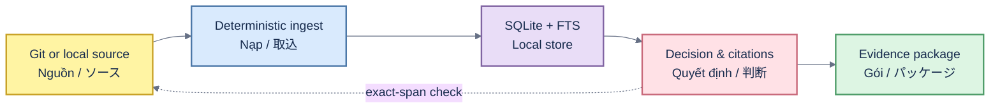

# Proofline architecture / Kiến trúc / アーキテクチャ

```mermaid
%%{init: {"theme":"base","themeVariables":{"background":"#FFFFFF","fontFamily":"Arial, sans-serif","lineColor":"#667085","primaryTextColor":"#172B4D"}}}%%
flowchart LR
    G["Git or local source<br/>Nguồn / ソース"]:::yellow
    I["Deterministic ingest<br/>Nạp / 取込"]:::blue
    Q["SQLite + FTS<br/>Local store"]:::purple
    A["Decision & citations<br/>Quyết định / 判断"]:::pink
    P["Evidence package<br/>Gói / パッケージ"]:::green
    G --> I --> Q --> A --> P
    A -. exact-span check .-> G
    classDef yellow fill:#FFF4A3,stroke:#C9A227,stroke-width:2px,color:#172B4D
    classDef blue fill:#D9EAFD,stroke:#4C78A8,stroke-width:2px,color:#172B4D
    classDef purple fill:#E9DDF7,stroke:#8064A2,stroke-width:2px,color:#172B4D
    classDef pink fill:#FFE1E6,stroke:#C96A7B,stroke-width:2px,color:#172B4D
    classDef green fill:#DDF5E3,stroke:#4F9D69,stroke-width:2px,color:#172B4D
```

## English

`apps/api/proofline/` owns ingestion, immutable source versions, exact spans, decision health and package verification. `apps/web/` is the local React client. `apps/desktop/` embeds the local service in a Tauri shell. Provider-specific AI remains optional and behind interfaces; provenance and verification do not depend on it.

## Tiếng Việt

`apps/api/proofline/` quản lý ingest, phiên bản nguồn bất biến, exact span, decision health và xác minh package. `apps/web/` là client React local; `apps/desktop/` đóng gói service local bằng Tauri. AI provider chỉ là tùy chọn và không tham gia vào contract provenance/xác minh.

## 日本語

`apps/api/proofline/` が取込、不変ソース版、正確な引用範囲、判断状態、パッケージ検証を担当します。`apps/web/` はローカル React クライアント、`apps/desktop/` はローカルサービスを組み込む Tauri シェルです。AI プロバイダーは任意で、来歴と検証の契約には依存しません。
