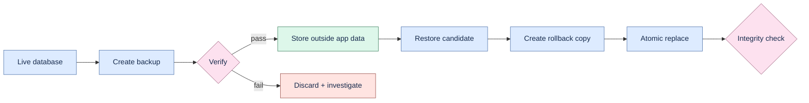

# Backup and recovery

Use only recoverable test data. Keep verified backups outside the active application-data directory.



## Create and verify

```bash
.venv/bin/proofline backup --output /safe/path/proofline.db
.venv/bin/proofline verify-backup /safe/path/proofline.db
.venv/bin/proofline verify-integrity
```

Backup uses SQLite's consistent backup mechanism and refuses accidental overwrite unless `--force`
is supplied. Verification checks the database structure and Proofline provenance contracts without
publishing source content.

## Restore

Stop Proofline before restoring. Verify the candidate, choose a rollback path outside the active
database, then run:

```bash
.venv/bin/proofline restore-backup /safe/path/proofline.db \
  --rollback-output /safe/path/proofline-before-restore.db
```

Restore rejects the active database path, SQLite sidecars, invalid schema, and unsafe path overlap.
It writes a rollback copy before atomically replacing the active database and performs post-restore
verification. Preserve both files until the application has been exercised successfully.

## Portable transfer

```bash
.venv/bin/proofline export --output /safe/path/proofline.json
.venv/bin/proofline verify-export /safe/path/proofline.json
.venv/bin/proofline import /safe/path/proofline.json
```

Import into a non-empty database requires preview plus explicit merge with the preview SHA-256.
Merge remaps identifiers deterministically and rolls back atomically on failure; it never performs a
destructive overwrite.
