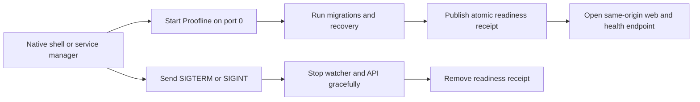

# Embedded runtime lifecycle

Proofline v0.10.0 defines the process contract, and v0.11.0 bundles the web UI into the installed
wheel so a future native shell or local service manager
can supervise. This is a packaging foundation, not a signed desktop application or a production
support claim.

## Start contract

Use one process for the API and an already-built web archive:

```bash
proofline serve \
  --host 127.0.0.1 \
  --port 0 \
  --data-dir "$HOME/Library/Application Support/Proofline" \
  --ready-file ./proofline-ready.json
```

- `--port 0` asks the OS for an available port and avoids a fixed-port collision.
- `--data-dir` owns the default `proofline.db` and `providers.json`. With
  `PROOFLINE_SECRET_STORE=os_keyring`, that JSON contains only non-secret provider settings; file
  mode may also keep API keys there with owner-only permissions. The equivalent environment
  variable is `PROOFLINE_HOME`; an explicit `PROOFLINE_DATABASE_URL` still overrides the database.
- The bundled web UI, API, and `/health` share one origin. `--no-web` starts API-only mode;
  `--web-dir` explicitly replaces the bundled UI and must contain `index.html`.
- `--ready-file` is written atomically with owner-only permissions after migrations, ingestion
  recovery, and watcher startup succeed. The same JSON is written to stdout.
- Failure before readiness exits without leaving a ready file. Error output contains a stable
  category, not source text or credentials.

The ready document contains only supervision metadata:

```json
{"event":"ready","host":"127.0.0.1","port":49152,"version":"0.10.0"}
```



## Stop and recovery contract

Send `SIGTERM` or `SIGINT` and wait for a zero exit code. Proofline stops accepting work, shuts down
the folder watcher, closes the API, and removes the ready file. If the process is killed after a
database write begins, the existing SQLite transaction and startup recovery rules still apply.

Before replacing or migrating a data directory, use the verified backup and integrity workflows in
[Data export, backup, and recovery](./backup-recovery.md). A wrapper must never copy a live SQLite
database file directly and must keep rollback data until the restored process is healthy.

## Support boundary

This contract has local automated coverage for dynamic-port startup, readiness, bundled same-origin
web serving from a cleanly installed wheel, data-directory creation, `/health`, graceful `SIGTERM`,
and cleanup. The v0.14.12 macOS release receipt also exercises verified-backup restore/rollback and
OS-keyring set/read/delete through the installed wheel. Windows, installer signing, application
update rollback, native auto-launch, and production qualification remain unverified gates.
