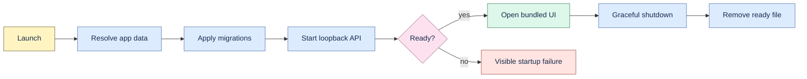

# Embedded lifecycle

The bundled launcher and Tauri sidecar share one local runtime contract.



## Start

1. Resolve a platform application-data directory or an explicit `--data-dir`.
2. Create owner-controlled state and configure SQLite inside it.
3. Apply migrations before accepting requests.
4. Bind FastAPI to loopback on the requested or a dynamic port.
5. Write readiness metadata only after the server and bundled UI respond.
6. Open the local UI unless `--no-browser` is set.

```bash
.venv/bin/proofline launch
.venv/bin/proofline launch --no-browser --port 0
```

## Stop

SIGINT/SIGTERM and the desktop private shutdown endpoint request graceful server termination. The
ready file is removed after clean shutdown. The private token is process-local and must not appear
in logs or public API responses.

## Desktop wrapper

The Tauri application starts the target-specific frozen sidecar, waits for its readiness file, and
navigates its webview to the same-origin loopback UI. It kills the child only when graceful shutdown
cannot complete. The current macOS package is unsigned and experimental.

## Failure states

Migration, bind, readiness, sidecar, and browser-open failures are explicit. A stale readiness file
does not prove a live server. No lifecycle receipt proves installer signing, uninstall, upgrade,
rollback, Windows behavior, or production readiness unless those observations are recorded on the
target platform.
