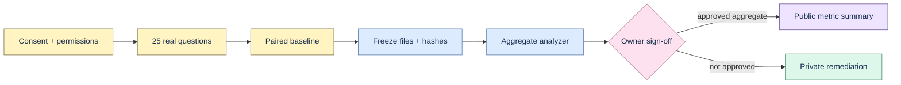

# External pilot protocol

The pilot tests whether Proofline improves real engineering context recovery. Raw pilot material
stays in a private, access-controlled workspace and is never committed to this repository.



## Minimum dataset

- Five permissioned engineering teams or design partners.
- At least 25 real questions with frozen relevance judgments.
- At least 10 questions about decisions that changed over time.
- A paired manual baseline recording time, sources opened, completion, and confidence.
- One human judgment for every emitted citation.
- Weekly non-demo usage and explicit commercial signals.

## Collection rules

Obtain consent, assign opaque IDs, document retention/deletion, and remove direct identifiers. Keep
source text, exact quotes, participant identity, company name, credentials, prompts, and model output
private. Excluded or withdrawn records retain an explicit reason and never enter the denominator.

Freeze the dataset by recording a shared dataset version and SHA-256 for each file. Do not edit a
frozen artifact in place; create a new version.

## Analysis

Use copies of the templates under `evals/pilot/` with these names:

```text
manifest.json
questions.jsonl
attempts.csv
citations.csv
weekly-usage.csv
commercial-signals.csv
```

```bash
.venv/bin/python scripts/analyze_pilot.py /private/path/to/frozen-pilot \
  --output /private/path/to/pilot-gate-review.json
```

The analyzer fails on hash, version, identifier, foreign-key, synthetic-row, and citation-resolution
problems. Its result is an unsigned aggregate calculation until dataset and metric owners sign it.

## Go/no-go thresholds

- Citation precision ≥90%.
- Useful-answer rate ≥65%.
- Median time-to-context improvement ≥50%.
- Weekly qualifying use by at least three teams.
- Concrete willingness-to-pay from at least two teams.

Security qualification is recorded as `not_run_by_request` and cannot support a production claim.
