# Product brief

## Product

Proofline is verifiable Engineering Decision Memory for people who need to recover a decision and
independently inspect the evidence behind it.

## Problem

Engineering context is scattered across ADRs, repositories, notes, tickets, and meetings. Search
can recover similar text, but usually cannot answer four harder questions:

1. Which exact source revision supported the claim?
2. Which exact span was used?
3. Which transformation produced the derived object?
4. Has anything in that chain changed since review?

Without those answers, a knowledge app can repeat organizational memory but cannot defend it.

## Product promise

Every accepted derived object resolves to an immutable source identity and exact source span.
Content hashes bind the lineage into a deterministic Merkle DAG, and a portable evidence package
lets another machine recompute the same root hash without access to the original database.

```mermaid
flowchart LR
    C["Scattered context"] -->|ingest| S["Immutable sources"]
    S -->|exact spans| D["Reviewed decision"]
    D -->|hashed lineage| P["Evidence package"]
    P -->|offline verification| O["Defensible memory"]

    classDef problem fill:#FFE4E1,stroke:#A35D57,color:#172B4D;
    classDef source fill:#FFF4C2,stroke:#7A6F45,color:#172B4D;
    classDef evidence fill:#DDF7EA,stroke:#4C8B6B,color:#172B4D;
    classDef outcome fill:#EEE4FF,stroke:#765E9C,color:#172B4D;
    class C problem;
    class S source;
    class D,P evidence;
    class O outcome;
```

## Working user hypothesis

The initial user is a senior engineer or small engineering team maintaining a decision-heavy
system. The first ideal customer profile and paid surface remain hypotheses until a permissioned
external pilot provides evidence.

## Current scope

- One local user and local SQLite authority.
- Markdown, text, notes, registered folders, and explicitly registered local Git repositories.
- Deterministic ingestion, retrieval, exact citations, human-reviewed decisions, and audit history.
- JSON/ZIP Decision Evidence Packages with verify, explain, and diff workflows.
- Optional model providers behind interfaces, plus backup, portability, and deletion cascade.
- Bundled browser UI and experimental desktop packaging.

## Product priority

Deepen provenance before adding more artifact categories. The technical moat is a verifiable chain
from source to decision: deterministic hashes, strict invariants, recovery behavior, migration
coverage, adversarial input handling, and qualified scale limits.

## Non-goals

Rich editing, canvas, graph databases, generic agents, autonomous write-back, collaboration, broad
connector coverage, hosted sync, and enterprise controls are outside the current vertical slice.

## Success gates

The next product proof is a permissioned pilot with at least 25 real questions, including 10
temporal cases; 90% citation precision; 65% useful-answer rate; 50% median time improvement; weekly
use by three teams; and two concrete willingness-to-pay signals.
