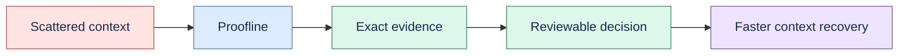

# Product brief

## Product

Proofline is an evidence-first Engineering Decision Memory for people who need to recover what was
decided, why it changed, and which exact source supports the answer.

## Problem

Engineering context is fragmented across ADRs, repositories, notes, tickets, and meetings. Search
often returns plausible text without preserving version, permission, or exact location. Conventional
knowledge tools also blur accepted decisions, extracted suggestions, and model-generated summaries.

## Promise

Proofline keeps every derived object attached to an immutable source version and exact span. It
shows uncertainty, abstains when evidence is insufficient, and requires humans to accept or reject
governed memory and action proposals.

## Current user

The working hypothesis is an individual senior engineer or a small engineering team maintaining a
decision-heavy system. The first ICP and paid surface remain open until an external pilot provides
evidence.

## Current scope

- Local files, registered folders, notes, and explicitly registered local Git repositories.
- Search, grounded answers, decisions and temporal relations, study workflows, and Evidence Studio.
- Local SQLite, local-first operation, optional model providers, backup, portability, and deletion.
- Bundled browser UI and experimental desktop packaging for a single local user.

## Non-goals

Rich editing, canvas, graph database, generic agents, autonomous write-back, collaboration, broad
connector coverage, hosted sync, and enterprise controls are not part of the current vertical slice.

## Success gates

The next product proof is a permissioned pilot with at least 25 real questions, 10 temporal cases,
90% citation precision, 65% useful-answer rate, 50% median time improvement, weekly use by three
teams, and two concrete willingness-to-pay signals.
