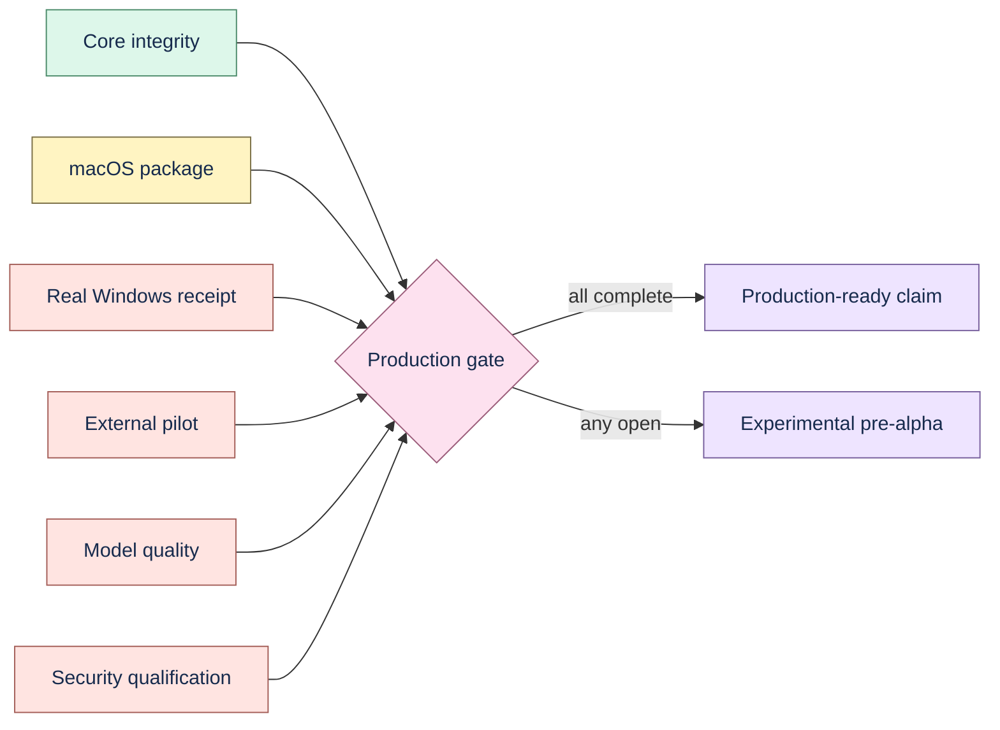

# Production readiness

Status: **not production-ready**. v1.0.0 is an experimental release for approved,
recoverable local test data.

The stale-decision demo, read-only CI check, HTML report, open DEP schema, and synthetic benchmark
strengthen the local provenance story only. They do not close authenticity, distribution, external
utility, model-quality, security, or representative-scale gates below.

| Gate | Status | Evidence or blocker |
| --- | --- | --- |
| Public repository and community policy | Complete for pre-alpha | MIT license, contribution, conduct, support, security, and ownership files |
| Reproducible local release | Complete on macOS ARM64 | v1.0.0 wheel, source, web bundle, DMG, receipts, and checksums |
| Immutable provenance and deletion | Complete for tested schema | Migration, exact-evidence, integrity, portability, and deletion suites |
| Offline deterministic core | Complete | Credential-free ingestion, retrieval, review, and Studio regression suites |
| Backup and rollback | Complete for tested local SQLite path | Versioned installed-artifact receipt; operator still owns retention and encryption |
| Provider secret storage | Complete on macOS | Keychain set/read/delete receipt; Windows receipt pending |
| Windows lifecycle | Blocked | Workflow exists but has not run on a real Windows machine |
| Native packaging | Partial | Unsigned macOS Tauri DMG; signing, notarization, uninstall, upgrade, and updater rollback open |
| Real-model quality | Blocked | Only mock/synthetic regression evidence exists |
| External utility | Blocked | Analyzer exists; no consented external pilot result exists |
| Security qualification | Blocked | Excluded from the current scope |

Production-ready local desktop requires every gate above to close with versioned target-specific
evidence. A mock provider, synthetic corpus, screenshot, source build, or cross-build cannot replace
a real model, participant, platform, signing, recovery, or security receipt.

Next order: qualify Windows; sign and exercise native installers; run the external pilot; complete
model and security qualification if those scopes are later authorized.
