# Provenance model

Proofline separates stable source identity from immutable source versions, then binds every derived
artifact to exact offsets and line ranges in one version. A derived claim is accepted only after all
of its evidence references resolve inside the same workspace and source-version boundary.

```mermaid
flowchart LR
    I["Stable source identity"] -->|publishes immutable revision| V["Source version"]
    V -->|deterministically parses| C["Chunk nodes"]
    V -->|anchors exact offsets + lines| Q["Citation nodes"]
    C -->|bounds cited content| Q
    Q -->|supports| A["Decision artifact"]
    T["Transformation receipt"] -->|derives| A
    A -->|receives human state| R["Review node"]
    A -->|hash parent| P["Package root"]
    R -->|hash parent| P

    classDef source fill:#FFF4C2,stroke:#7A6F45,color:#172B4D;
    classDef evidence fill:#DDF7EA,stroke:#4C8B6B,color:#172B4D;
    classDef process fill:#DDEBFF,stroke:#5B7DB1,color:#172B4D;
    classDef human fill:#FDE1EF,stroke:#9C5E7B,color:#172B4D;
    classDef outcome fill:#EEE4FF,stroke:#765E9C,color:#172B4D;
    class I,V source;
    class C,Q evidence;
    class T,A process;
    class R human;
    class P outcome;
```

## Identity and revision

`Source.id` is the stable local identity; its identity digest is domain-separated from content.
`SourceVersion` carries the immutable content SHA-256, version number, parser version, length, and
content. Re-ingestion under the same URI creates a new version only when content changes. Old
versions stay addressable while derived records depend on them.

## Exact span contract

Chunks and citations carry `source_id`, `source_version_id`, start/end offsets, start/end lines, and
content hashes. Verification slices the stored source content at those offsets, recomputes line
numbers and hashes, and rejects cross-source, cross-version, missing, or malformed references.

Stale-decision detection adds a current-state question without rewriting history: does the exact
approved quote still resolve in the source's current immutable version? If not, the old decision and
package remain valid historical records, but the review state requires human attention.

## Merkle DAG

DEP v1 uses canonical UTF-8 JSON, sorted keys, compact separators, and domain-separated SHA-256.
Package creation time and application version are informational and excluded from the root. The
semantic artifact and mutable review state are separate nodes, so review changes produce a new root
without changing the artifact identity.

The full normative field and hash rules are in [Decision Evidence Packages](evidence-packages.md)
and the [open format](../spec/decision-evidence-package/README.md).
