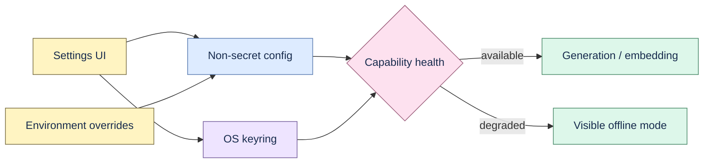

# Provider configuration

Deterministic ingestion, lexical search, review, backup, and portability do not require a model.
Generation and embeddings are optional and can be configured in the UI under **Settings**.



## Fields

- Generation: provider, base URL, model, and API key.
- Embedding: provider, base URL, model, and API key.
- Remote access: explicit `allow_remote_ai` opt-in.

Environment variables override saved settings:

```bash
export PROOFLINE_AI_PROVIDER=openai_compatible
export PROOFLINE_AI_BASE_URL=http://127.0.0.1:11434/v1
export PROOFLINE_AI_MODEL=model-name
export PROOFLINE_AI_API_KEY=optional-secret
export PROOFLINE_EMBEDDING_PROVIDER=openai_compatible
export PROOFLINE_EMBEDDING_BASE_URL=http://127.0.0.1:11434/v1
export PROOFLINE_EMBEDDING_MODEL=embedding-model
export PROOFLINE_EMBEDDING_API_KEY=optional-secret
export PROOFLINE_ALLOW_REMOTE_AI=false
```

## Secret storage

Desktop launch on macOS and Windows defaults to the OS keyring. Development defaults to an
owner-readable local configuration file. Override only when you understand the tradeoff:

```bash
export PROOFLINE_SECRET_STORE=os_keyring
```

The API reports whether a key is configured but never returns it. Replacing or removing a key is
explicit. Provider keys are excluded from model-run records, exports, backups, and normal logs.

## Failure behavior

Generation, embedding, and reranking health are reported separately. Transient requests use bounded
retry; failed model runs remain visible and can enter the dead-letter/retry workflow. Proofline never
silently falls back from a local provider to a remote provider.

Mock provider runs require explicit opt-in and remain labelled `mock_integration`. They test wiring,
not model quality.
