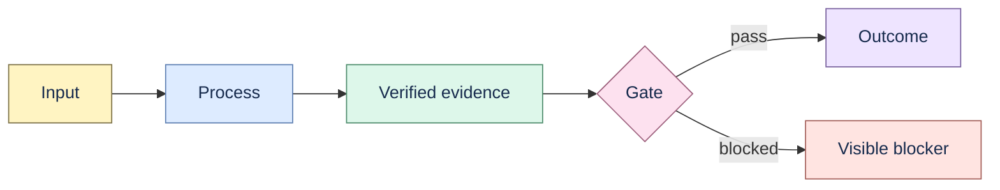

# Visual language

Proofline diagrams use a collaborative-canvas language inspired by Miro's emphasis on central
concepts, branching hierarchy, standard shapes, labelled connectors, and color categories. The
implementation is original, static Mermaid rendered by the documentation host; it does not copy
Miro assets, fonts, templates, or branding.

## Typography

No page downloads a font or calls a font service. Product UI, desktop loading, and landing page use
the operating system's native sans-serif stack:

```css
system-ui, -apple-system, BlinkMacSystemFont, "Segoe UI Variable", "Segoe UI",
Roboto, Helvetica, Arial, sans-serif
```

Code and immutable identifiers use the native monospace stack:

```css
ui-monospace, SFMono-Regular, Menlo, Monaco, Consolas, "Liberation Mono", monospace
```

Use weights 400–700. Keep body text at least 16 px on marketing surfaces and 13 px inside the dense
application UI. Do not add `@font-face`, Google Fonts, Adobe Fonts, npm font packages, or remote CSS.

## Diagram grammar



- Flow left to right when time or transformation matters.
- Use a central node with balanced branches for mind maps and ownership graphs.
- Use one color per semantic role, paired with a label; color alone never carries meaning.
- Label conditional connectors and show explicit start/end or pass/blocked states.
- Keep node labels short; put detail in prose immediately after the diagram.
- Prefer one useful diagram to several decorative graphics.

References: [Miro workflow diagrams](https://miro.com/diagramming/what-is-a-workflow-diagram/),
[Miro mind maps](https://miro.com/mind-map/), and
[Miro connectors](https://developers.miro.com/docs/work-with-connectors).
