# Windows local release

Run this only on a real Windows x64 machine with Python 3.12, Node.js, Rust/MSVC, WebView2,
WiX/NSIS prerequisites, and authenticated GitHub CLI.

```mermaid
flowchart LR
    C["Clean main + skip CI"] --> T["Local tests & evals"]
    T --> B["Build wheel + sidecar"]
    B --> I["Build MSI + NSIS"]
    I --> R["Target receipts"]
    R --> H["Checksums"]
    H --> G["GitHub release"]

    classDef input fill:#FFF4C2,stroke:#7A6F45,color:#172B4D;
    classDef process fill:#DDEBFF,stroke:#5B7DB1,color:#172B4D;
    classDef evidence fill:#DDF7EA,stroke:#4C8B6B,color:#172B4D;
    classDef outcome fill:#EEE4FF,stroke:#765E9C,color:#172B4D;
    class C input;
    class T,B,I process;
    class R,H evidence;
    class G outcome;
```



```powershell
py -3.12 -m venv .venv
.venv\Scripts\pip.exe install -e ".[dev]"
npm install
powershell -ExecutionPolicy Bypass -File scripts\release_windows.ps1 -Tag v0.14.17
```

The script requires a clean `main` equal to `origin/main` and a release commit containing
`[skip ci]`. It runs local tests/evaluations, builds wheel, web bundle, frozen sidecar, MSI, and
NSIS, creates installed-wheel and desktop receipts, writes checksums, pushes the tag, and publishes
through GitHub CLI without relying on GitHub Actions.

`windows_desktop_receipt.py` refuses non-Windows hosts. The receipt proves a target-specific build
and sidecar smoke only; it does not prove Authenticode, installer UI, uninstall, upgrade, rollback,
reputation, or production readiness.
