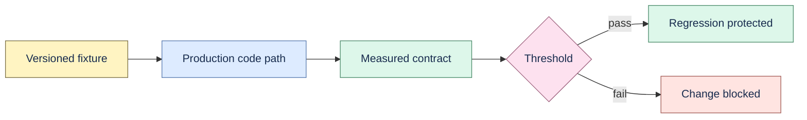

# Evaluations

Everything checked into `evals/` is synthetic or a target-specific development receipt. It protects
deterministic contracts and must not be presented as real-model, external-pilot, adoption, or
production-performance evidence.



## Quality gate

```bash
make eval
```

The gate runs:

- `extraction/seed-v1.json`: deterministic memory kinds and exact evidence.
- `retrieval/seed-v2.json`: current-version lexical retrieval, Unicode, and expected-empty cases.
- `grounded-qa/seed-v1.json`: scripted grounded answers, citation resolution, and abstention.

Expected scores are intentionally perfect because these are regression fixtures. Change behavior by
adding a new dataset version rather than silently weakening an existing expectation.

## Benchmarks

`benchmarks/` records environment-specific watcher, lexical, vector-index, and deterministic
reranker observations. Reproduce them with the matching Make target or script. A benchmark receipt
describes only its revision, fixture, hardware, and command; it is not a portable scale guarantee.

## Model comparison

`real-model/` contains the versioned comparison shape and explicit mock fixtures. Mock execution
requires `--allow-mock`, uses no provider network, and produces `mock_integration` qualification.
Real-model comparison remains outside the current execution scope.

## Pilot material

`pilot/` contains private-study templates only. `pilot-simulation/` contains invented personas and
scripted tasks for credential-free workflow regression. Neither directory contains external pilot
evidence. Follow [`docs/pilot-protocol.md`](../docs/pilot-protocol.md) for a real study.
