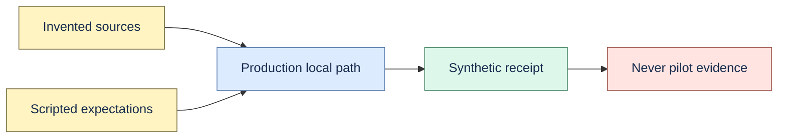

# Synthetic pilot simulation

`engineering-context-v1.json` contains invented sources and scripted expectations. It exercises
production migrations, ingestion, retrieval, bounded evidence, grounded-answer validation, and
exact citation resolution without credentials or network access.



```bash
make simulate-pilot
```

The result is labelled `synthetic_pilot_simulation`. Completion means scripted status, statement
kinds, expected sources, and exact citations matched. Its source-inspection baseline is not human
time, its citation score is not human entailment judgment, and its latency is local-only.

Do not count simulation output toward real questions, useful-answer rate, weekly adoption,
willingness-to-pay, external citation precision, or production performance.
