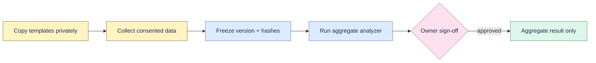

# External pilot templates

These templates contain no external pilot results. Copy them to a private access-controlled
workspace, remove the synthetic example row, and never commit raw questions, answers, source spans,
company names, participant identities, credentials, prompts, or model output.



## Templates

- `manifest.v1.template.json`: consent, ownership, retention, dataset version, and hashes.
- `questions.v1.template.jsonl`: one question/relevance record per line.
- `attempts.v1.template.csv`: paired manual and Proofline observation.
- `citations.v1.template.csv`: one human judgment per emitted citation.
- `weekly-usage.v1.template.csv`: one team/week observation.
- `commercial-signals.v1.template.csv`: dated buyer signals.
- `security-platform.v1.template.csv`: platform and security observations.
- `gate-review.v1.template.json`: fixed thresholds and owner decision.

Use UTC timestamps, ISO weeks, lowercase booleans, opaque random IDs, explicit missingness, and a new
dataset version for every frozen revision. Verify unique IDs, foreign keys, paired timing, one
judgment per citation, at least 25 eligible questions, at least 10 temporal questions, and SHA-256
for every artifact.

## Aggregate analysis

Rename private working copies to `manifest.json`, `questions.jsonl`, `attempts.csv`, `citations.csv`,
`weekly-usage.csv`, and `commercial-signals.csv`, then run:

```bash
.venv/bin/python scripts/analyze_pilot.py /private/path/to/frozen-pilot \
  --output /private/path/to/pilot-gate-review.json
```

The output is an unsigned aggregate calculation until data and metric owners sign it. Follow the
full [`pilot protocol`](../../docs/pilot-protocol.md).
